# **ElectronBili**

## 介绍

ElectronBili是一套基于RTT与LVGL的电子宠物表情系统，项目灵感来源于稚晖君桌面小摆件项目ElectronBot。恰逢RTT，NXP与LVGL联动白嫖活动，心血来潮，也想做一个自己的电子宠物，所以就有了本项目。

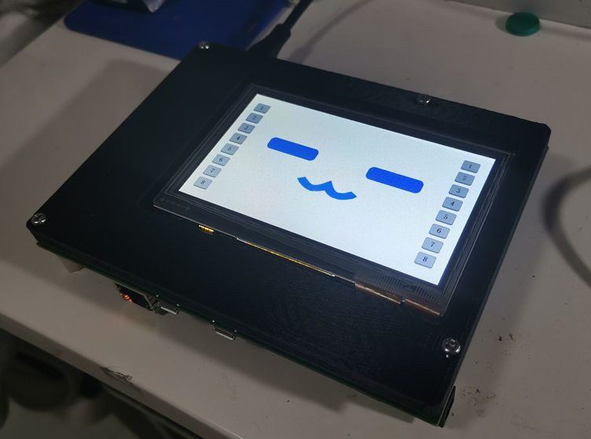

**演示视频：在做了在做了，尽情期待**

项目为室内宠物无人机的前置项目，设想制作一个类似于《守望先锋》中小美的机械宠物**`雪球`**的小型室内无人机，可在专门配置的充电桩上充电，可根据预设的指令飞行，并与用户进行多种类的交互。

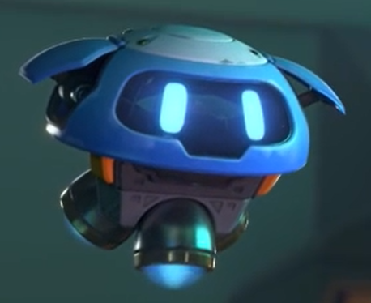

## 系统架构

系统架构如图所示：

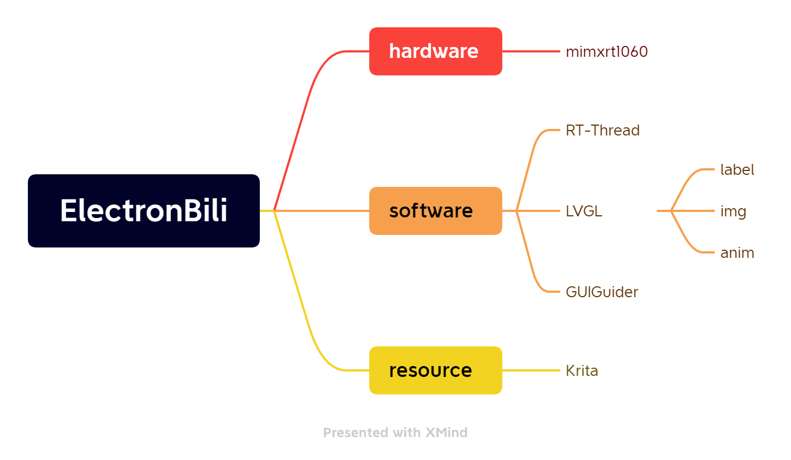

其中，resource是指电子表情的图片资源，使用Krita作为绘图软件绘制动图，导出png序列以供lvgl显示。根据室内宠物无人机的目标需求，设计了如下所示的创意文档：

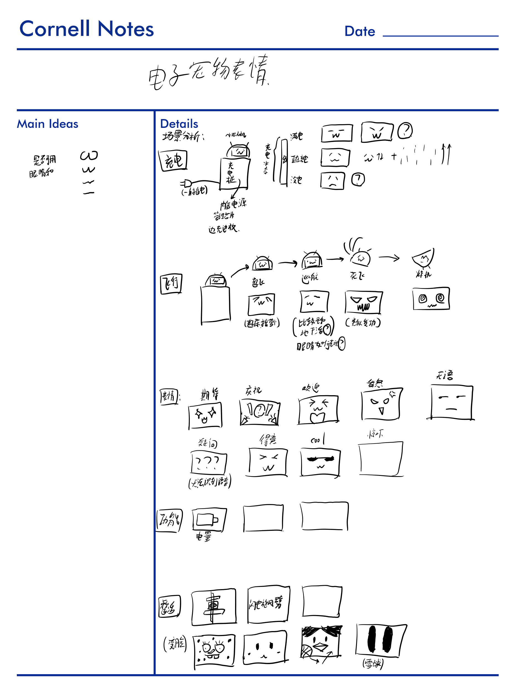

## 主要功能

-   显示bilibili小电视图案
-   表情根据指令做出相应变化
    -   睡觉
    -   休息
    -   专注
    -   向左看
    -   向右看
    -   其他编码后的表情

**注：功能展示见bilibili视频**

## 尚未完成的功能

-   显示创意文档上的其余表情
-   添加文件系统，实现LVGL存储并显示更多图片内容
-   添加语音识别系统，将交互方式从触摸按键变成识别语音
-   整合进入宠物无人机中，作为其面部显示图案（不知道要鸽到什么时候）

## 开发过程与关键点记录

### 表情显示思路

使用lvgl显示表情的思路大致包括两种：

1.  画好整张图片，整个显示；
2.  设置分立的label等元素，分别显示并设置动画效果。

我们首先按照前者的思路推进进度，完成了png图片队列的绘制。但是经过尝试，整张图片序列占用空间太大，在没有调通文件系统的情况下，flash可存储的空间很少，只能改变方案，选用分立元素分别显示的方案。

>   注：无法使用line实现眼睛，因为动画效果无法改变line的两点的坐标，只能改变line对象的坐标（即只能平移，无法旋转，无法变换形状），故未使用line

分立元素方案中，我们使用**GuiGuider**绘制，使用label作为眼睛，图片作为嘴巴。通过改变label的宽高和位置来模拟表情。最终实现了简单表情的绘制。

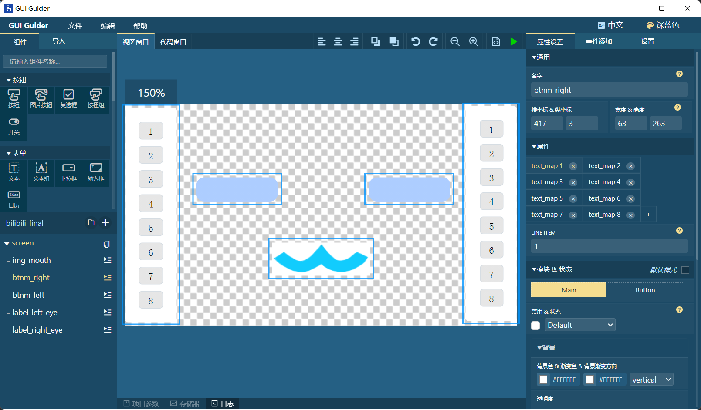

最终效果如下：

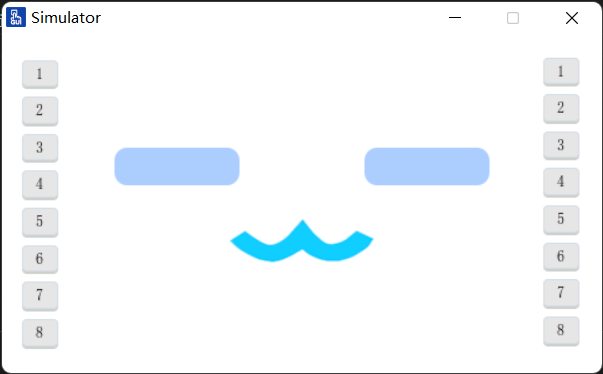

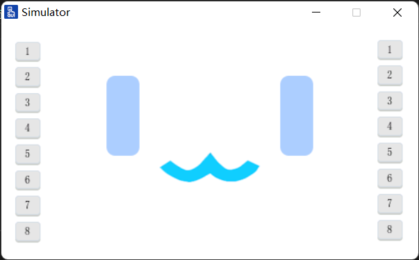

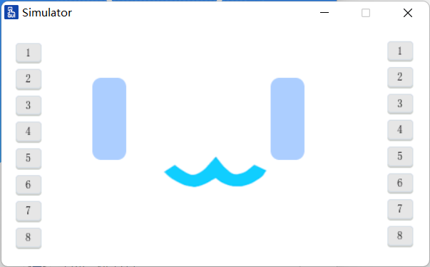

### 环境配置-RTThread

曾尝试使用**`RTT ENV TOOL`** + **`KEIL`** 的工具链搭建开发环境，但这样搭建的开发环境无论如何无法解决触摸屏驱动初始化失败的问题。并在尝试的过程中浪费了很多时间。偶然间通过以下视频了解到**将bsp导入 RTT Studio**进行开发的方式：

>   [How to Use LVGL with RT Thread Studio in STM32F469 Discovery Board - YouTube](https://www.youtube.com/watch?v=O_QA99BxnOE)

尝试后，可以通过编译，但又遇到了下载代码报错pyocd错误的问题，报错信息如下：

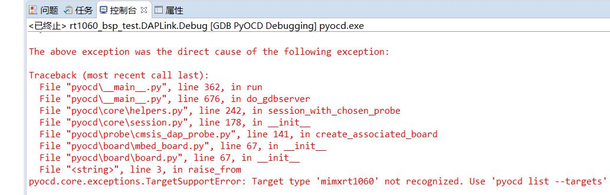

在于群友交流后，得知是因为RTT Studio默认的pyocd版本太低，不适配 mimxrt1060开发板的原因，解决方案可参考该链接中的说法，亲测有效。

>   [RT-Thread-关于pyocd，我自己答RT-Thread问答社区 - RT-Thread](https://club.rt-thread.org/ask/question/f1cb48cfd461b2f5)

操作步骤简述如下：

-   建议使用anaconda创建一个pyocd的虚拟环境，安装pyocd
-   在RTT Studio中进行**调试配置**，调试仿真选择**DAP-link**，设备名称填写**mimxrt1060**

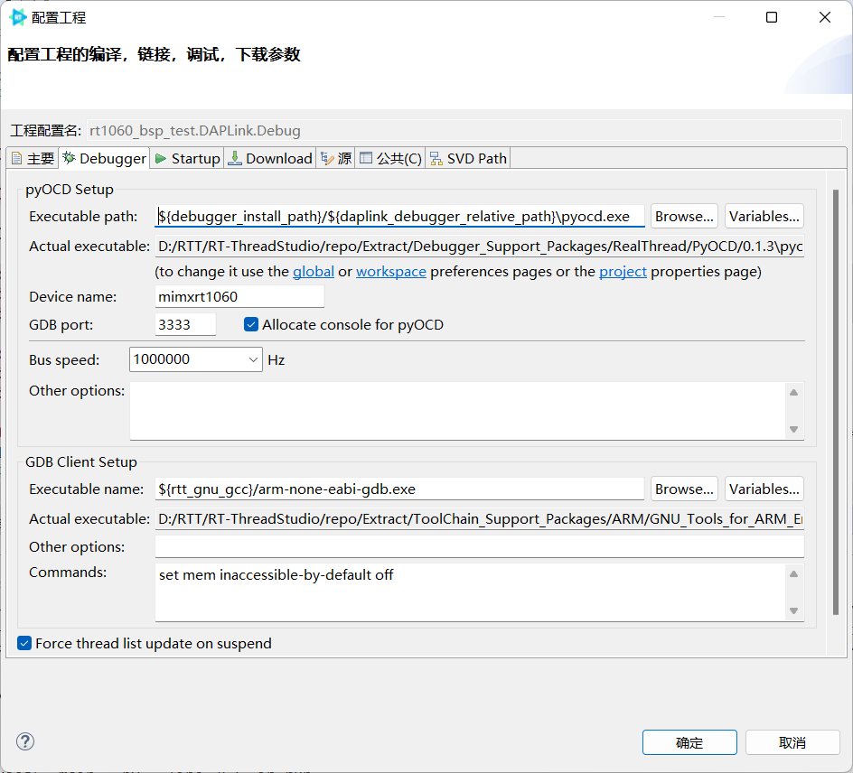

-   在RTT Studio中点击 **下载程序**按钮，并将下方控制台的报错信息中的pyocd指令信息复制出来

    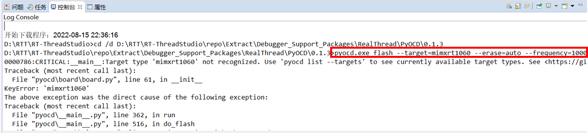

-   打开anaconda 命令行，直接将上述指令信息复制，点击运行即可

    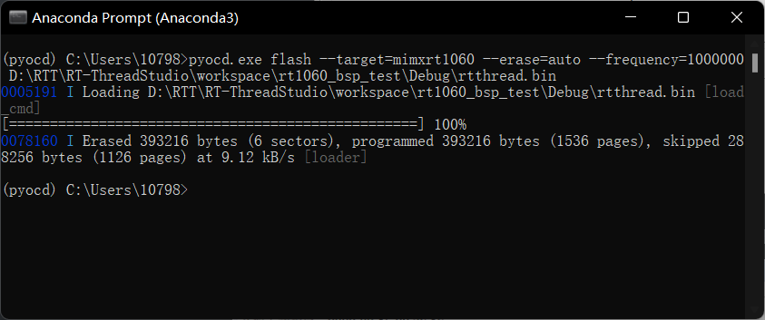

-   烧录完成

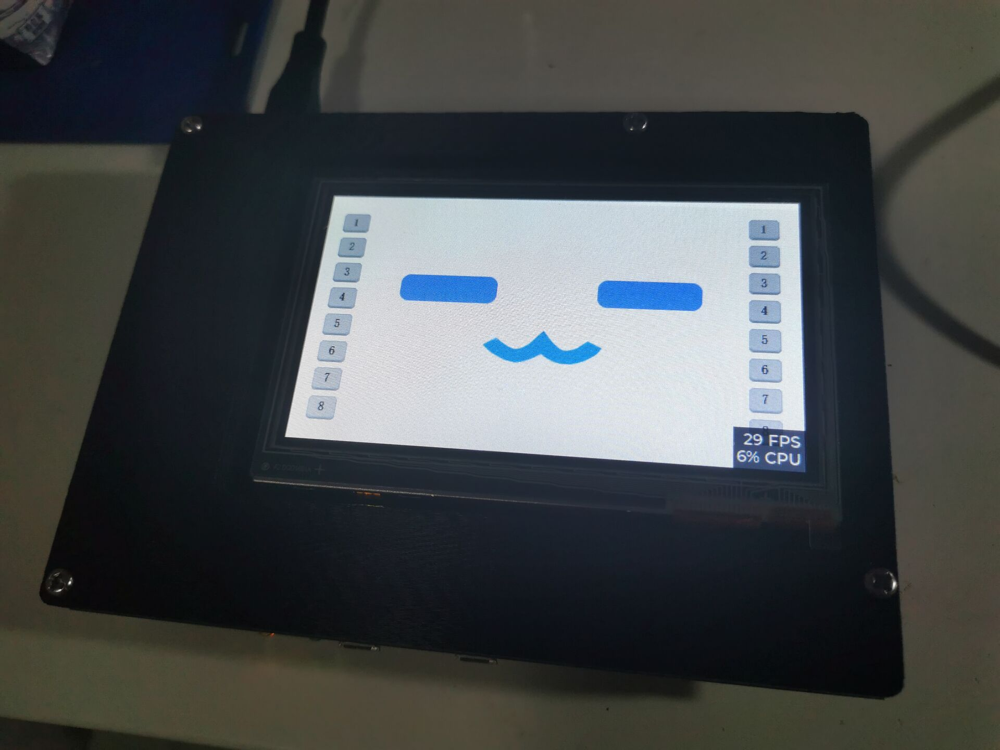

>   **注：但是，使用这种方式烧录只能运行一次，复位或者重新上电均会导致图形界面无法运行，目前没有解决。**

### 环境配置-nxp

另外，恩智浦的官方IDE：**MCUXpresso**对恩智浦的开发板支持更加稳定与完善，验证图形界面阶段可使用该IDE进行调试，效果特别理想。

## 学习笔记

### LVGL相关

-   [十几分钟学会如何使用lvgl设计器gui guider和模拟器编写一个简单计算器应用_哔哩哔哩_bilibili](https://www.bilibili.com/video/BV1LU4y1q7vd?spm_id_from=333.337.search-card.all.click&vd_source=4ff5d8b280178b24895437b1b8ffd97e)

### RTT工具链相关

-   [How to Use LVGL with RT Thread Studio in STM32F469 Discovery Board - YouTube](https://www.youtube.com/watch?v=O_QA99BxnOE)
-   [RT-Thread-关于pyocd，我自己答RT-Thread问答社区 - RT-Thread](https://club.rt-thread.org/ask/question/f1cb48cfd461b2f5)
-   [(122条消息) NXP i.MXRT10xx 开发板程序跑飞、下载失败、连接CPU失败 - [已解决\]_HowieXue的博客-CSDN博客](https://blog.csdn.net/HowieXue/article/details/102869743)

### 参考案例

-   [ComponentsLib: 基于新唐N9H30硬件平台，RTThread+LVGL软件平台的便携式器件库存管理系统。LVGL嵌入式GUI挑战赛作品。 (gitee.com)](https://gitee.com/chengjili/components-lib)

